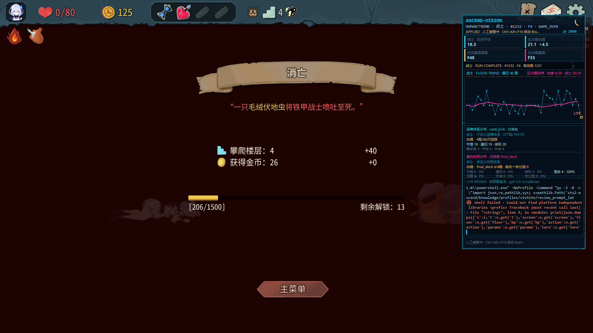
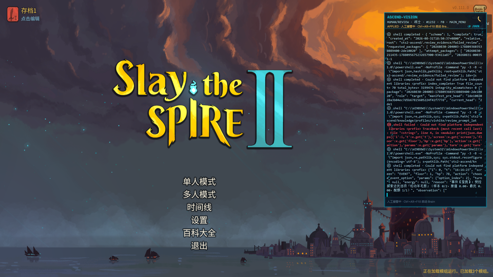
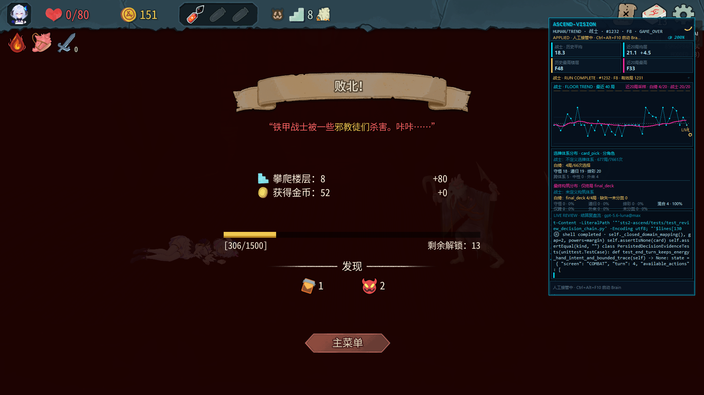
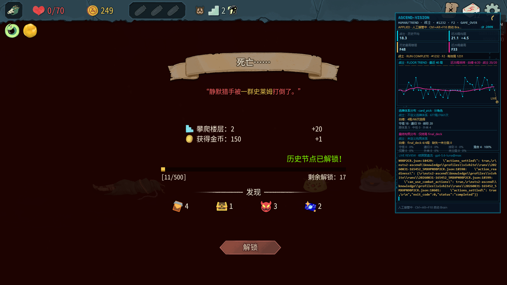
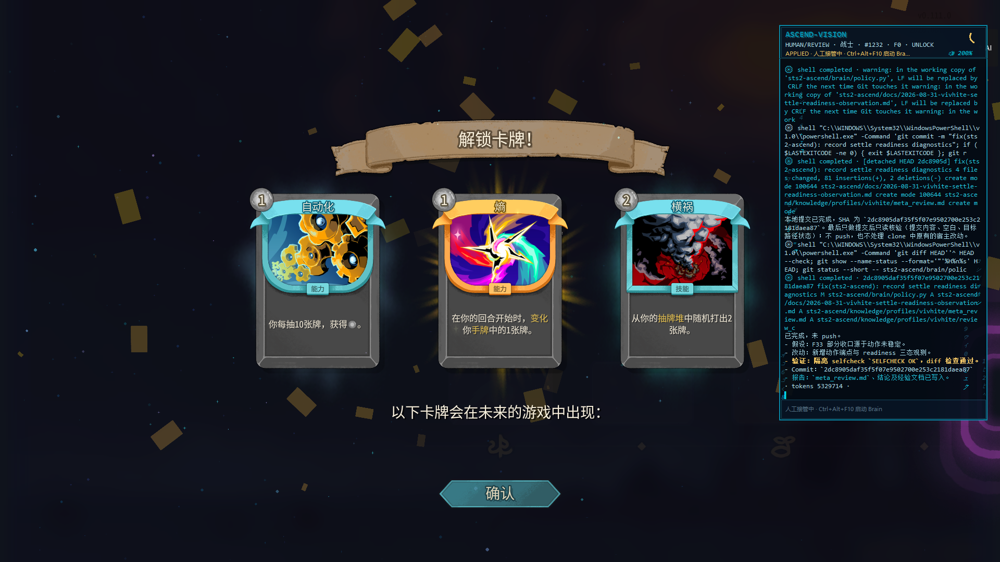
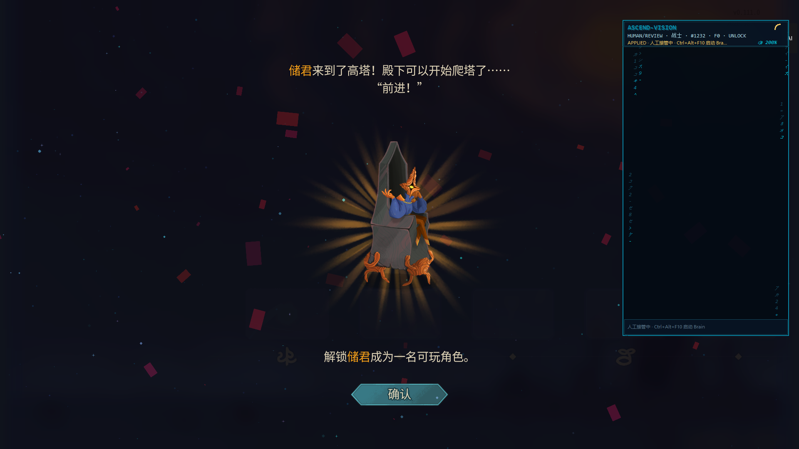
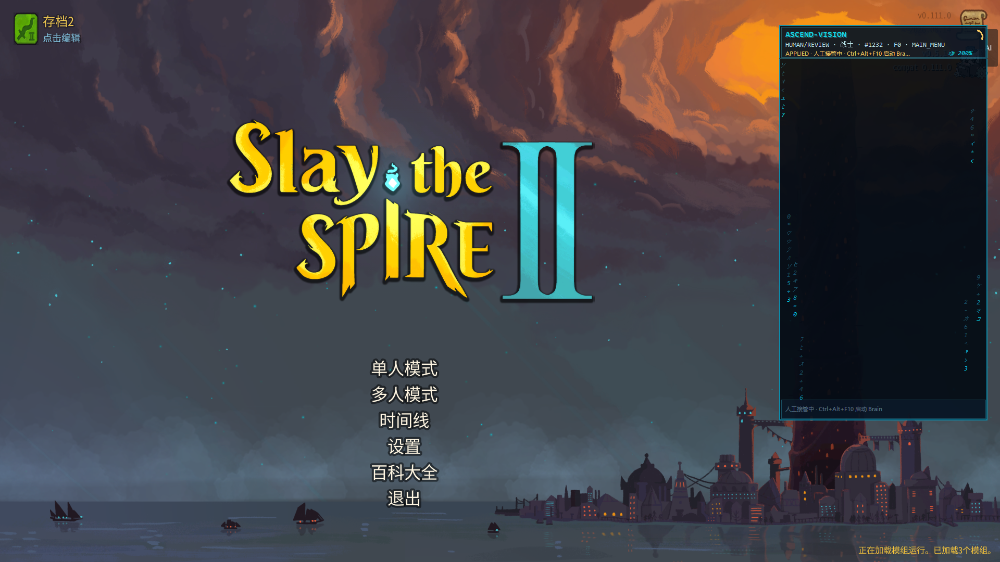
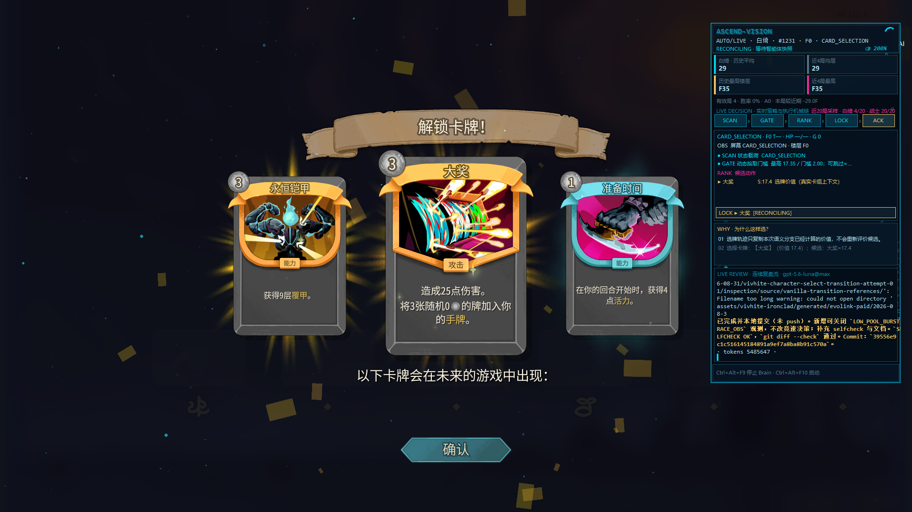

# Native game-over progression live evidence

> Historical snapshot: this records the 2026-08-31 native game-over regression, not current state. Current status: [PRODUCT_PLAN_CURRENT.md](../../../PRODUCT_PLAN_CURRENT.md).

This directory records the real-game regression performed on 2026-08-31 for
PR #53 (`fix/native-game-over-progression`), including the follow-up unlock
screen classification fix at commit `16e97cf`.

## Environment and result

- Game: Slay the Spire 2 `v0.111.0`, Chinese locale, Vulkan renderer.
- Agent: the fork build from `fix/native-game-over-progression`.
- Automated regression: all 60 executable C# contract tests passed.
- Native progression result: the game-over Continue action persisted the score
  before navigation, native unlock cards were reported as `UNLOCK`, and the
  complete unlock queue returned to `MAIN_MENU`.
- The ASCEND-VISION panel is intentionally visible in the screenshots. It is
  the live consumer of the same API state and makes the reported screen type
  (`GAME_OVER`, `UNLOCK`, or `MAIN_MENU`) visible beside the native UI.

## Ordinary score persistence and return to main menu

Run `E85M5TBB994B` ended on floor 4 and awarded 40 points. After the native
Continue action (`req_20260831_105203_1606_1063`), the profile displayed
`206/1500`; the API also verified that the progress save changed on disk.
The native Main Menu action
(`req_20260831_105308_3563_1338`) then returned to the main menu.





An additional profile-1 run reached floor 8 and persisted another 80 points,
leaving the native progress display at `306/1500`:



## Unlock-threshold regression

The next unlock threshold on the long-lived profile was 1500, so a nearly
empty profile was used for an isolated threshold test. Its original
`progress.save` was backed up byte-for-byte with SHA-256
`97BCCEC503BB6C8A5C9602FB4BCDD003BFA2966F63E1B4108477313760D41F8A`, and only
`current_score` was temporarily seeded to 190. The profile was restored to
that exact hash after the test.

Run `G6RNJ1E0NR5Z` then ended on floor 2 and awarded 20 floor points plus one
gold point. Before Continue, the save hash was
`0DB9752D885745FFA600BDC03226C3C46B2F6079B0936D05BE440D3B4DE889C6`.
The native Continue request was `req_20260831_114055_0510_10968`. Its response
reported `save_verified=true`; the saved progression became
`current_score=11`, `total_unlocks=1`, and the relevant unlock epochs became
obtained after consuming the 200-point threshold. The post-save hash was
`AD2301569D01FACB7BF565DA560F7F5B281F30A585E27EC862D795F331294E70`.



The native route was then followed without bypassing any UI:

1. game-over Main Menu action opened the Timeline;
2. selecting the obtained epoch opened its story overlay;
3. confirming the story opened a real `NUnlockCardsScreen`;
4. confirming the card unlock returned to Timeline and advanced the queued
   character unlock;
5. confirming that unlock and closing Timeline returned to the main menu.

At the real `NUnlockCardsScreen`, state request
`req_20260831_114434_9381_11961` reported:

```text
screen = UNLOCK
available_actions = ["confirm_unlock"]
unlock.type = NUnlockCardsScreen
```

`/actions/available` also exposed only `confirm_unlock`; it did not expose
`select_deck_card`.



The queued native character unlock was handled through the same
`confirm_unlock` contract:



After the final confirmation and Timeline close, state request
`req_20260831_114835_0299_13039` reported `screen=MAIN_MENU`, no `timeline`
payload, no `unlock` payload, and only the normal main-menu actions.



## Reproduction note

The in-game debug console was used only to shorten combat and reach the floor-2
and floor-8 game-over summaries. It was not used to grant an unlock, invoke the
score save, skip the native Continue action, bypass Timeline, confirm an unlock,
or return to the main menu.

For comparison, the pre-fix build incorrectly treated a native unlock-card
screen as generic `CARD_SELECTION`, which exposed the wrong deck-card action
and left automation unable to complete the unlock queue:



An additional crop of the same stuck screen lives at
[../../assets/unlock-screen-stuck.png](../../assets/unlock-screen-stuck.png).
